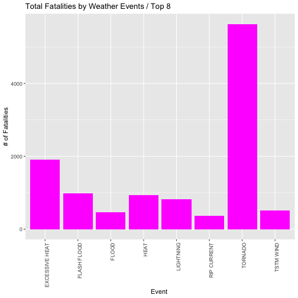
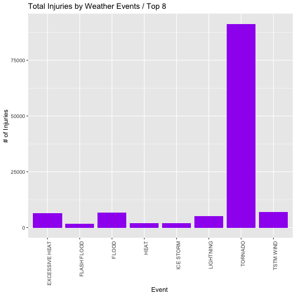
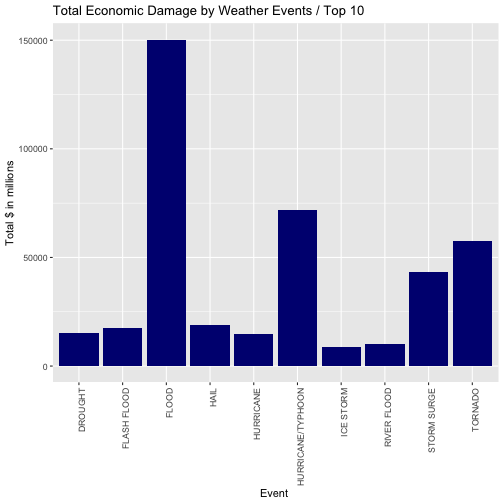

# Exploring the US National Oceanic and Atmospheric Administration´s (NOAA) storm database that tracks major storms and weather events.

## Synopsis

The events in the database start in the year 1950 and end in November 2011. Storms and other severe weather events can cause both public health and economic problems for communities and municipalities. Many severe events can result in fatalities, injuries, and property damage, and preventing such outcomes to the extent possible is a key concern.
our data analysis must address the following questions:

  1. Across the United States, which types of events (as indicated in the EVTYPE variable) are most harmful with respect to population health?

  2. Across the United States, which types of events have the greatest economic consequences?

## Data Processing

### Loading and pre-processing the data

Download the file to a directory within local computer
The character "~" is the local root directory by default

Then load packages


```r
setwd("~/Documents/JOHN HOPKINS UNIV/MONTH 05 Reproducible Research/MO05-Week04/Assignmt_Mo5_Week04")

library(dplyr)
```

```
## 
## Attaching package: 'dplyr'
```

```
## The following objects are masked from 'package:stats':
## 
##     filter, lag
```

```
## The following objects are masked from 'package:base':
## 
##     intersect, setdiff, setequal, union
```

```r
library(ggplot2)
```

load the data 


```r
StormDataRaw <- read.csv("repdata-data-StormData.csv", header=TRUE, stringsAsFactors=FALSE)

## head(StormDataRaw) to check details

dim(StormDataRaw)
```

```
## [1] 902297     37
```


Could also check individual / unique items 

eg:   id_uniq_fields <- sapply(StormDataRaw, unique) ## way of checking the contents; summary(id_uniq_fields) 

      


### Calculate Total Fatalities and Injuries

Because adding up two variables fatalities and injuries is incompatible, this work will present two different plots one for Fatalities and one for Injuries 

Add up all Fatalities by Specific Event and report on major 8 Events


```r
## First add up
sumEventsFatal <- aggregate(FATALITIES ~ EVTYPE, StormDataRaw, sum, na.rm = TRUE)

## quick check
## head(sumEventsFatal,10)

## order by top 8 events that cause fatalities
Top_eight_fatal <- sumEventsFatal[order(-sumEventsFatal$FATALITIES), ][1:8, ]

## Plot

ggplot(Top_eight_fatal, aes(x = EVTYPE, y = FATALITIES)) + 
  geom_bar(stat = "identity", fill = "magenta") + 
  theme(axis.text.x = element_text(angle = 90, hjust = 1)) + 
  xlab("Event ") + ylab("# of Fatalities") + ggtitle("Total Fatalities by Weather Events / Top 8")
```



The event Tornado causes the most fatalities


### Add up all Injuries by Specific Event and report on major 8 Events


```r
## First add up
sumEventsInjuries <- aggregate(INJURIES ~ EVTYPE, StormDataRaw, sum, na.rm = TRUE)

## quick check
head(sumEventsFatal,10)
```

```
##                   EVTYPE FATALITIES
## 1     HIGH SURF ADVISORY          0
## 2          COASTAL FLOOD          0
## 3            FLASH FLOOD          0
## 4              LIGHTNING          0
## 5              TSTM WIND          0
## 6        TSTM WIND (G45)          0
## 7             WATERSPOUT          0
## 8                   WIND          0
## 9                      ?          0
## 10       ABNORMAL WARMTH          0
```

```r
## order by top 8 events that cause fatalities
Top_eight_injuries <- sumEventsInjuries[order(-sumEventsInjuries$INJURIES), ][1:8, ]


## Plot
ggplot(Top_eight_injuries, aes(x = EVTYPE, y = INJURIES)) + 
  geom_bar(stat = "identity", fill = "purple") + 
  theme(axis.text.x = element_text(angle = 90, hjust = 1)) + 
  xlab("Event ") + ylab("# of Injuries") + ggtitle("Total Injuries by Weather Events / Top 8")
```



The event Tornado causes the most injuries


### Calculate Economic Damage by Event

It is basically the same calculations as the first two plots. However, to get the right answer tnew fields have to be added to account for the fact that PropDMG and CropDmg (property damage and crop damage) fields need to adjusted. Both fields PROPDMGEXP and CROPDMGEXP will include a letter eg "H" to disclose the fact that the amount is in a different volumen of magnitude. "H" accounts for Hundreds or 100 and  "K", "M" and "B" to thousands, millions and billions. (10^3, 10^6, 10^9)


```r
## First created a subset working file with only the fields we will need

wf <- subset(StormDataRaw, select = c("EVTYPE", "PROPDMG", "PROPDMGEXP", "CROPDMG", "CROPDMGEXP"))

id_uniq_wf <- sapply(wf, unique) ## way of checking the contents 
summary(id_uniq_wf)
```

```
##            Length Class  Mode     
## EVTYPE      985   -none- character
## PROPDMG    1390   -none- numeric  
## PROPDMGEXP   19   -none- character
## CROPDMG     432   -none- numeric  
## CROPDMGEXP    9   -none- character
```

```r
## to understand what variables are stored
id_uniq_wf$PROPDMGEXP
```

```
##  [1] "K" "M" ""  "B" "m" "+" "0" "5" "6" "?" "4" "2" "3" "h" "7" "H" "-"
## [18] "1" "8"
```

```r
id_uniq_wf$CROPDMGEXP
```

```
## [1] ""  "M" "K" "m" "B" "?" "0" "k" "2"
```

```r
## As can be seen there are other values than just H, K, M, B for all others the program will multiply by one

## created another working file "xf"  to store the results 

xf <- wf %>%
  mutate(PropTot = case_when(
    PROPDMGEXP == "H" ~ PROPDMG * 10^2,
    PROPDMGEXP == "K" ~ PROPDMG * 10^3,
    PROPDMGEXP == "M" ~ PROPDMG * 10^6,
    PROPDMGEXP == "B" ~ PROPDMG * 10^9,
    TRUE ~ PROPDMG * 1 
  )) %>%
  mutate(CropTot = case_when(
    CROPDMGEXP == "H" ~ CROPDMG * 10^2,
    CROPDMGEXP == "K" ~ CROPDMG * 10^3,
    CROPDMGEXP == "M" ~ CROPDMG * 10^6,
    CROPDMGEXP == "B" ~ CROPDMG * 10^9,
    TRUE ~ CROPDMG * 1 
  ))
  
## check if variables where converted ok 

chk1 <- subset(xf, PROPDMGEXP == "m")
head(chk1, 10)
```

```
##                    EVTYPE PROPDMG PROPDMGEXP CROPDMG CROPDMGEXP PropTot
## 187584     HURRICANE OPAL    20.0          m      10          m    20.0
## 195369            TORNADO     0.5          m       0                0.5
## 196712            TORNADO    10.0          m       0               10.0
## 202891               HAIL     4.9          m       0                4.9
## 203087 THUNDERSTORM WINDS     2.0          m       0                2.0
## 207157 THUNDERSTORM WINDS     0.5          m       0                0.5
## 211464            TORNADO     1.0          m       0                1.0
##        CropTot
## 187584      10
## 195369       0
## 196712       0
## 202891       0
## 203087       0
## 207157       0
## 211464       0
```

```r
chk2 <- subset(xf, PROPDMGEXP == "B")
head(chk2, 10)
```

```
##                            EVTYPE PROPDMG PROPDMGEXP CROPDMG CROPDMGEXP
## 187564               WINTER STORM     5.0          B     0.0           
## 187566  HURRICANE OPAL/HIGH WINDS     0.1          B    10.0          M
## 195000             HURRICANE OPAL     2.1          B     5.0          M
## 195001 TORNADOES, TSTM WIND, HAIL     1.6          B     2.5          M
## 195007             HURRICANE OPAL     1.0          B     0.0           
## 198389                RIVER FLOOD     5.0          B     5.0          B
## 207175  HEAVY RAIN/SEVERE WEATHER     2.5          B     0.0           
## 243445        SEVERE THUNDERSTORM     1.2          B     0.0           
## 298088                      FLOOD     3.0          B     0.0           
## 347872                  HURRICANE     1.7          B   301.0          M
##        PropTot  CropTot
## 187564 5.0e+09 0.00e+00
## 187566 1.0e+08 1.00e+07
## 195000 2.1e+09 5.00e+06
## 195001 1.6e+09 2.50e+06
## 195007 1.0e+09 0.00e+00
## 198389 5.0e+09 5.00e+09
## 207175 2.5e+09 0.00e+00
## 243445 1.2e+09 0.00e+00
## 298088 3.0e+09 0.00e+00
## 347872 1.7e+09 3.01e+08
```

```r
xf$TotDamage <- xf$PropTot + xf$CropTot


## Highest Damage

sumEconomicDamage <- aggregate(TotDamage ~ EVTYPE, xf, sum, na.rm = TRUE)

head(sumEconomicDamage)
```

```
##                  EVTYPE TotDamage
## 1    HIGH SURF ADVISORY    200000
## 2         COASTAL FLOOD         0
## 3           FLASH FLOOD     50000
## 4             LIGHTNING         0
## 5             TSTM WIND   8100000
## 6       TSTM WIND (G45)      8000
```

```r
Top_ten_Ec_damage <- sumEconomicDamage[order(-sumEconomicDamage$TotDamage), ][1:10, ]

ggplot(Top_ten_Ec_damage, aes(x = EVTYPE, y = TotDamage/10^6)) + 
  geom_bar(stat = "identity", fill = "navyblue") + 
  theme(axis.text.x = element_text(angle = 90, hjust = 1)) + 
  xlab("Event ") + ylab("Total $ in millions") + ggtitle("Total Economic Damage by Weather Events / Top 10")
```




## RESULTS 

### As can be seen Tornado is the event that causes more fatalities and injuries. However in economic terms, Flood is what causes more damage.
